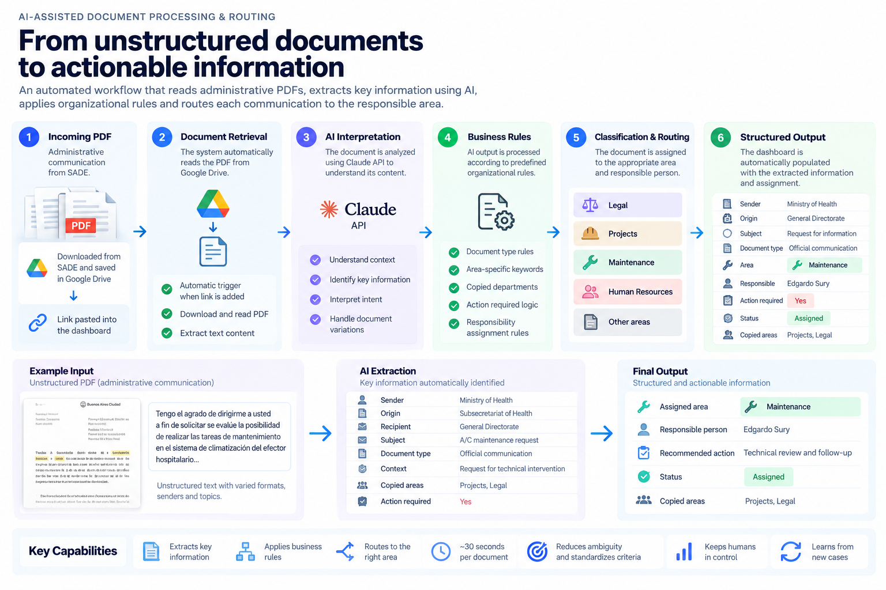

# AI-Assisted Document Processing & Routing

**Claude API · Google Apps Script · Google Drive · Workflow Automation · Document Intelligence**

> Turning unstructured administrative documents into structured, actionable operational information.

---

## Overview

Our team receives administrative communications every day through a government document management system.

Each communication arrives as a PDF and needs to be reviewed to understand:

- Who sent it
- Where it originated
- What it is about
- Which operational area it concerns
- Who should take responsibility
- Whether an action is required
- Whether other departments were copied for informational purposes

Historically, this classification depended heavily on individual interpretation.

I designed an AI-assisted workflow that reads each PDF, extracts relevant information, interprets its content and combines AI analysis with predefined organizational rules to automatically classify and route the communication.

The result is a structured operational dashboard where each responsible person can immediately identify the documents requiring their attention.

---

## The Problem

Incoming administrative communications need to be reviewed and routed every day.

The previous workflow required someone to:

1. Access the document management system
2. Open the incoming communication
3. Download the PDF
4. Read the complete document
5. Identify the sender and origin
6. Understand the subject and context
7. Determine which operational area it concerned
8. Decide who should take responsibility
9. Determine whether an action was required
10. Manually register the information in a tracking dashboard

A document typically required **5+ minutes** to process.

The challenge, however, was not only processing time.

Routing decisions also depended heavily on individual interpretation. Two people could read the same communication and reach different conclusions about who should handle it.

The opportunity was therefore to improve both **efficiency and consistency**.

---

## The Solution

I designed an AI-assisted document processing workflow combining a large language model with explicit organizational business rules.

The human operator performs only the initial administrative steps:

1. Download the incoming PDF
2. Store it in Google Drive
3. Paste the Drive link into the tracking dashboard

As soon as the link is added, processing begins automatically.

The workflow retrieves the document, sends its content through the AI processing layer, extracts the relevant information, evaluates the applicable business rules and automatically populates the corresponding dashboard row.

---

## How It Works

The workflow follows this sequence:

`Incoming PDF`

→ Stored in Google Drive

→ Link added to operational dashboard

→ Automatic processing triggered

→ Document retrieved and read

→ Claude API interprets content

→ Relevant information extracted

→ Organizational business rules applied

→ Responsible area and person determined

→ Required action identified

→ Dashboard automatically populated

---

## What the System Extracts

The workflow transforms an unstructured administrative PDF into structured operational information.

Depending on the document, it can identify:

- Sender
- Organizational origin
- Recipient
- Subject
- Document title
- Relevant operational area
- Responsible person
- Required action
- Informational vs. actionable status
- Relevant copied departments

The extracted information is automatically written into the tracking dashboard.

---

## Business Rules + AI

The system does not rely exclusively on an LLM making an unconstrained decision.

AI interpretation is combined with predefined business rules derived from the way the organization actually operates.

Communications can be routed to different operational areas, including:

- Legal
- Projects
- Maintenance
- Human Resources
- Other operational responsibilities

The workflow also evaluates contextual conditions.

For example, when a relevant management area is already copied on a communication, the document may be treated as informational rather than generating a new internal assignment.

These rules were developed iteratively by analyzing real incoming communications and identifying recurring organizational patterns.

---

## From Individual Judgment to Consistent Routing

One of the main objectives was to reduce ambiguity in document classification.

### Before

`Read document → Interpret content → Decide responsible area → Register manually`

### After

`Add document link → AI interpretation → Business rules → Structured assignment`

This creates a more consistent routing process and reduces dependence on individual interpretation while preserving human oversight for exceptional cases.

---

## Human-in-the-Loop

The workflow was not designed to eliminate human responsibility.

People remain responsible for:

- Ensuring the correct source documents are available
- Acting on assigned communications
- Flagging an assignment if it appears incorrect
- Reviewing exceptional or previously unseen cases
- Periodically validating classification quality

Routine classification can therefore run automatically while human attention is concentrated on exceptions and the actual work required by each communication.

---

## Continuous Improvement

The system was developed iteratively rather than from a fixed set of assumptions.

A large number of real document scenarios were analyzed to identify recurring routing patterns and edge cases.

When a genuinely new case appears, the workflow can evolve:

`New scenario → Human review → Identify missing rule → Update instructions or logic → Future documents benefit`

As coverage improved, classification exceptions became increasingly uncommon.

---

## Impact

| Metric | Manual Process | AI-Assisted Workflow |
| --- | --- | --- |
| Documents | 6–12/day | 6–12/day |
| Processing time | 5+ min/document | ~30 sec/document |
| Classification | Individual interpretation | AI + standardized business rules |
| Data extraction | Manual | Automated |
| Dashboard entry | Manual | Automated |
| Routing | Manually determined | Automatically classified |
| Quality control | During every classification | Periodic + exception-based |

### ~90% reduction in processing time

Processing decreased from more than five minutes per document to approximately thirty seconds.

The operational improvement goes beyond time savings.

The workflow created a **repeatable classification framework**, making document routing more consistent and allowing responsible team members to find their assigned communications directly in the operational dashboard.

---

## My Role

I identified the automation opportunity after observing recurring inconsistencies in how incoming communications were interpreted and assigned.

The problem was not simply that reading documents took time.

The underlying issue was that important routing decisions depended on organizational knowledge that existed informally across the team.

I analyzed recurring document types and routing decisions, mapped the organizational rules behind those decisions and translated them into an AI-assisted workflow.

My work included:

- Process analysis
- Business-rule mapping
- Classification logic design
- AI prompt and instruction design
- API integration
- Workflow automation
- Dashboard integration
- Testing against real document scenarios
- Iterative refinement based on exceptions

This project reflects a core principle of my approach to automation:

> **Automation starts by understanding how people make decisions, not by choosing a technology.**

---

## Tech Stack

`Claude API` · `Google Apps Script` · `Google Drive` · `Google Sheets` · `Applied AI` · `Workflow Automation`

---

## Privacy & Confidentiality

This public case study describes the workflow architecture without exposing administrative documents, personal information, internal identifiers or confidential organizational data.

No real documents, production credentials or sensitive information are included in this portfolio.

The visual examples are sanitized representations created exclusively to explain the workflow.

---

## What I Would Improve Next

Future iterations could include:

- Confidence scoring for classifications
- A dedicated low-confidence review queue
- Structured audit logs for AI decisions
- Automated classification-quality metrics
- Versioning of prompts and business rules
- Additional monitoring for API or processing failures
- A feedback interface for correcting exceptional classifications

---

[← Back to Portfolio](../README.md)
