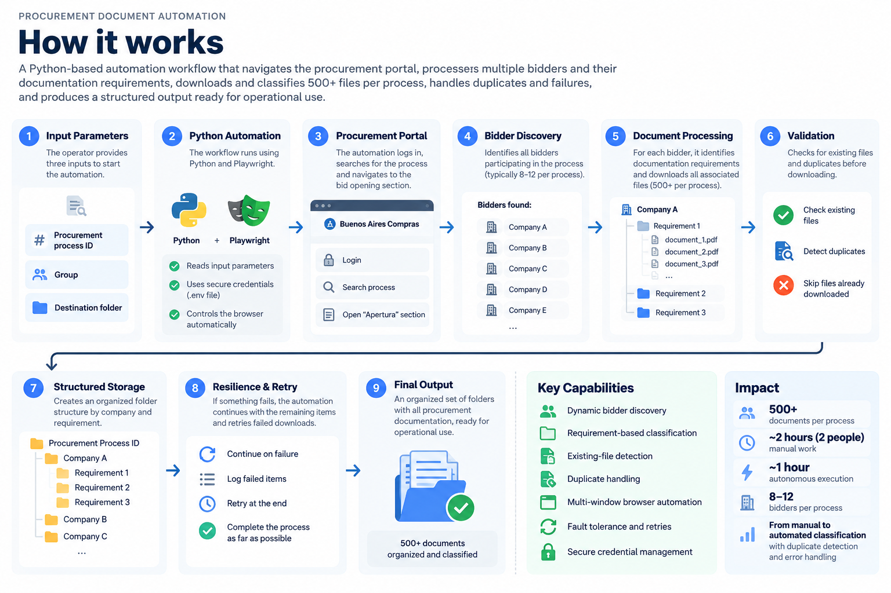

# Procurement Document Automation

**Python · Playwright · Browser Automation · Process Automation**

> Automating a high-volume procurement workflow involving multiple bidders, documentation requirements and 500+ files per process.

---

## Overview

A government procurement process required our team to retrieve, classify and organize hundreds of documents submitted by multiple bidders through a multi-step procurement portal.

During the first process, two people spent approximately two hours manually navigating the platform, opening each bidder, reviewing documentation requirements, downloading files, creating folder structures and organizing the resulting documents.

With multiple procurement processes expected over the following months, repeating the same workflow manually would consume significant operational capacity.

Instead of scaling the manual work, I designed and built a browser automation workflow to execute the process autonomously.

---

## The Problem

Each procurement process can involve approximately **8–12 bidders**.

Each bidder has multiple documentation requirements, and each requirement may contain several individual files.

The manual workflow required:

1. Opening the procurement platform
2. Searching for the procurement process
3. Navigating to the bid-opening section
4. Identifying every bidder
5. Opening each bidder individually
6. Identifying its documentation requirements
7. Opening each requirement
8. Downloading every associated file
9. Determining how each document should be classified
10. Creating the corresponding folder structure
11. Detecting duplicate or previously downloaded files
12. Organizing the final documentation

A single procurement process can involve **500+ files**.

The first complete process required approximately **two hours of work involving two people**.

The repetitive nature of the workflow made it a strong candidate for automation.

---

## The Solution

I built a Python-based browser automation workflow using **Playwright**.

The operator provides only:

- Procurement process ID
- Group
- Destination folder

The automation then executes the operational workflow with minimal human intervention.

---

## How It Works

The workflow follows this sequence:

`Process ID + Group + Destination`

→ Secure authentication

→ Process search

→ Bidder discovery

→ Requirement identification

→ Document retrieval

→ Rule-based classification

→ Existing-file and duplicate checks

→ Structured folder creation

→ Failure logging and retries

→ Organized final output

---

## Key Capabilities

### Dynamic bidder discovery

The automation does not depend on a predefined list of companies. It identifies the bidders participating in each procurement process and iterates through them automatically.

### Requirement-based classification

The workflow recognizes the documentation requirement being processed and applies the corresponding classification rules automatically.

### Existing-file detection

Before processing a document, the automation checks whether the file has already been retrieved and skips unnecessary downloads.

### Duplicate handling

The workflow detects duplicate documents and prevents unnecessary copies from being added to the final structure.

### Multi-window browser automation

The procurement platform requires navigation across different pages and browser windows. The automation manages this programmatically while maintaining the correct process, bidder and requirement context.

### Fault tolerance and retries

An individual failure does not terminate the entire workflow. Failed items are recorded while the automation continues processing the remaining documents and can be retried at the end.

### Secure credential management

Authentication credentials are stored separately from the source code using environment variables (`.env`) rather than being hard-coded into the automation.

---

## Impact

| Metric | Manual Process | Automated Workflow |
| --- | --- | --- |
| Human involvement | 2 people | Minimal intervention |
| Execution | ~2 hours of active manual work | ~1 hour autonomous execution |
| Documents | 500+ per process | Automatically processed |
| Bidders | 8–12 per process | Automatically discovered |
| Classification | Manual | Rule-based automation |
| Duplicate handling | Manual review | Automated |
| Failure recovery | Manual | Logged + retry logic |

The main benefit is not simply reducing wall-clock execution time.

The automation transformed a process that required the active attention of two people into a workflow that can run independently while the team focuses on other operational tasks.

---

## My Role

I identified the automation opportunity after participating directly in the first manual procurement process.

Rather than treating the increasing workload as a staffing problem, I mapped the repetitive steps, identified the classification rules used by the team and translated those operational rules into an automated browser workflow.

I designed the workflow, tested it against real procurement processes and iteratively incorporated new capabilities as edge cases appeared.

This included:

- Requirement classification
- Duplicate detection
- Existing-file checks
- Multi-window navigation
- Failure logging
- Retry logic
- Secure credential management

This project reflects how I approach automation:

> **Understand the operation first, then design the technology around the process.**

---

## Tech Stack

`Python` · `Playwright` · `Browser Automation` · `Environment Variables` · `Process Automation`

---

## Privacy & Confidentiality

This case study describes the architecture and operational logic of the solution without exposing confidential information, authentication credentials, procurement documentation or internal organizational data.

The public portfolio contains only sanitized descriptions and visual representations.

---

## What I Would Improve Next

Future iterations could include:

- More structured execution logs and monitoring
- Automated execution metrics
- Improved exception categorization
- Notifications when a process completes or requires human intervention
- A configuration layer for classification rules
- Further separation between browser automation, business rules and storage logic

---

[← Back to Portfolio](../README.md)
